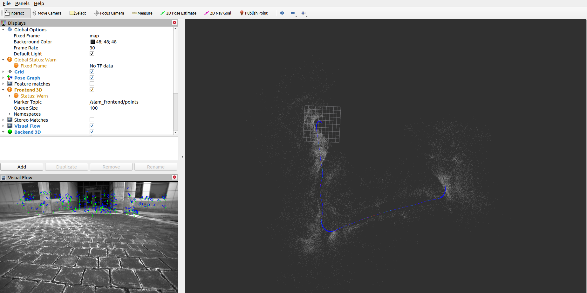

# Vision SLAM Frontend

SLAM is the process of mapping your surroundings and finding out where you are at the same time (hence simultaneous-localization-and-mapping, SLAM). This project is the frontend to a SLAM system, it takes [bags](http://wiki.ros.org/Bags) from robots with stereo cameras (two cameras, left and right) and detects feature points. These feature points are then matched between camera images using their descriptors (a mathematical represenation of what makes that point special) and we extrapolate an estimate of the points position in 3D space. For now this is outputted for visualization purposes. But this can easily (and has been, but closed source for now) be integrated into a backend for optimization and loop closure for a full SLAM system.

## Dependencies

You should install [ROS](http://wiki.ros.org/ROS/Installation) if you have not already. And then run the dependency install script:
```
sudo ./install_ubuntu.sh
```

Now you have to install OpenCV 3.2.0, which can be a pain so I have a archive with a working version and install instructions here:
[https://github.com/TheCynosure/opencv_3.2.0_archive](https://github.com/TheCynosure/opencv_3.2.0_archive)

Once that is installed you can navigate back to the `vision_slam_frontend` repo and build using the make command:

```
cd vision_slam_frontend
export ROS_PACKAGE_PATH=$(pwd):$ROS_PACKAGE_PATH
make
```

Tip: If you are building more than once then add the export line to your .bashrc file in your home directory to ease the building process.

### Example

An example bag file is provided here:
[https://drive.google.com/file/d/10S0RJzY4s5fhVMPuxOFW1nxVQfUfJFIq/view?usp=sharing](https://drive.google.com/file/d/10S0RJzY4s5fhVMPuxOFW1nxVQfUfJFIq/view?usp=sharing)

Once downloaded you will have to spin up the following ROS services, enter each of these commands in __a seperate terminal window__:
```
# Terminal 1
roscore
# Terminal 2
rviz -d visualization.rviz
# Terminal 3
./bin/slam_frontend -input=00098_2019-03-21-11-39-38.bag -visualize=true -output=output.bag
```

This will run the program and you will get something that looks like the following in your RViz window:



__Note__, this is just a frontend, so the path might not match the one taken in the bag. This is the point of having a SLAM backend to perform optimization and correct for odometry drift.

### Arguments:

The frontend supports the following arguments, only input and output are required.

- __input__: This argument is a string, it is the relative path to the input bag that contains the stereo camera images and odometry.
- __output__: This argument is a string, it is the name of the bag to output the ROS messages generated for the backend into.
- __visualize__: This argument is a boolean, should a window open to show the current left camera image?
- __save_debug__: This argument is a boolean, should we save debug images?
- __odom_topic__: This argument is a string, the name of the odometry topic to use, should be of type `nav_msgs/Odometry`.
- __left_image_topic__: This argument is a string, the name of the left camera image topic, should be of type `sensor_msgs/CompressedImage`.
- __right_image_topic__: This argument is a string, the name of the right camera image topic, should be of type `sensor_msgs/CompressedImage`.
- __max_poses__: This argument is an integer, it is the maximum number of poses to process, you can set this lower than the whole bag number of poses to process just the beginning.

__Note__, if you are having trouble finding your image topics, use the `rosbag info <bag filename>` command to find the names of all the topics and the types are list after the colon on the right.
